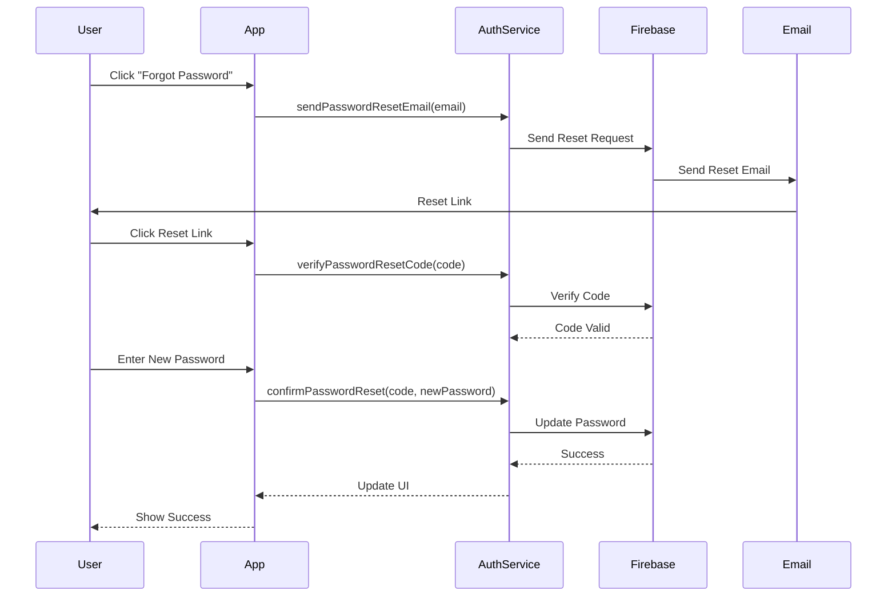
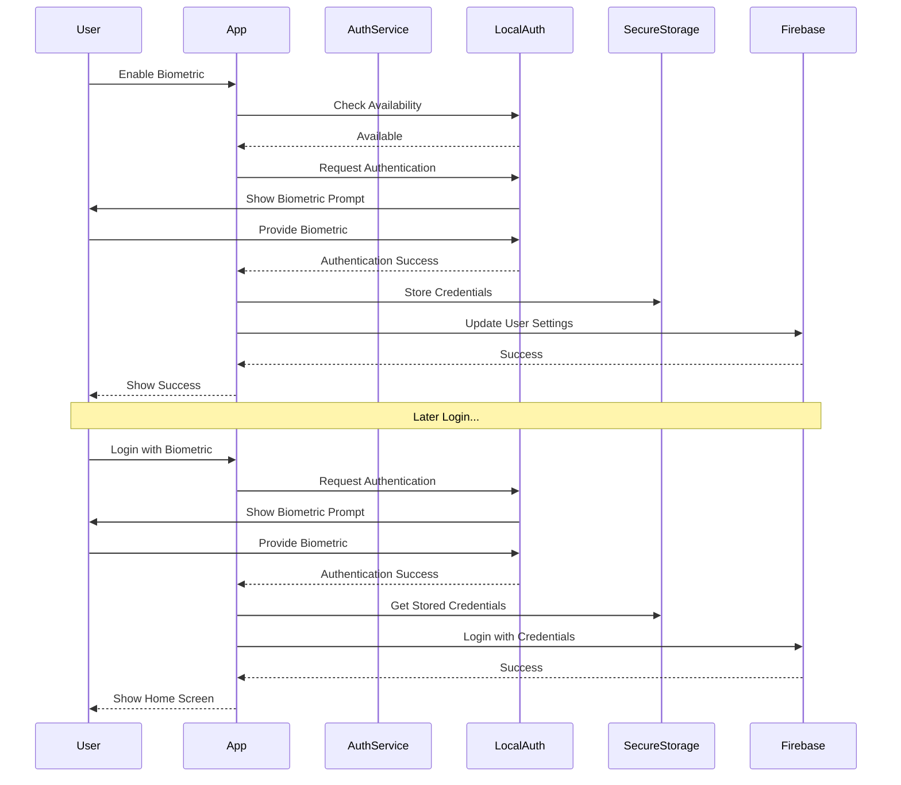
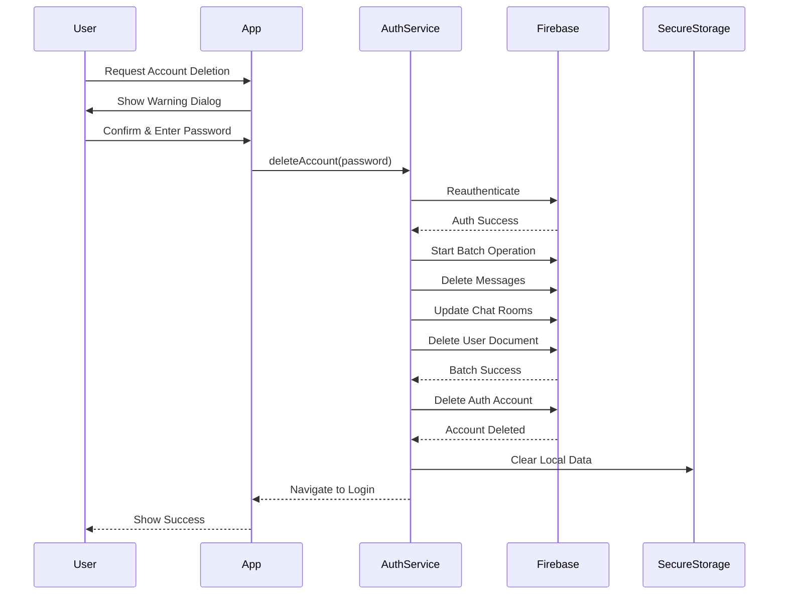
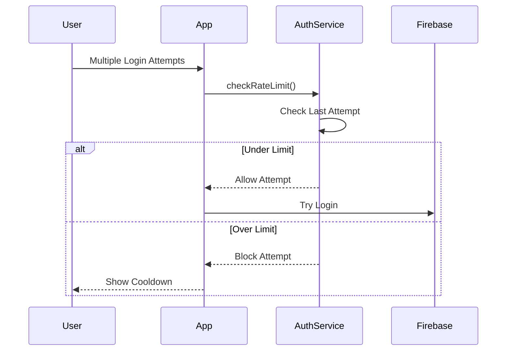
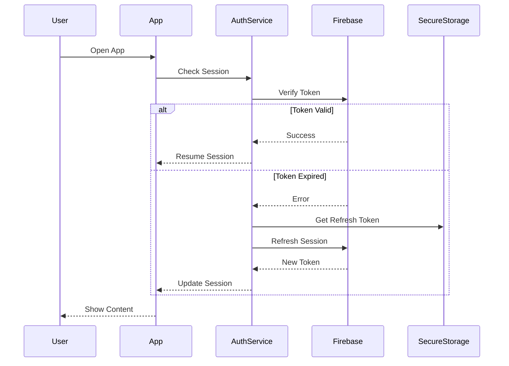
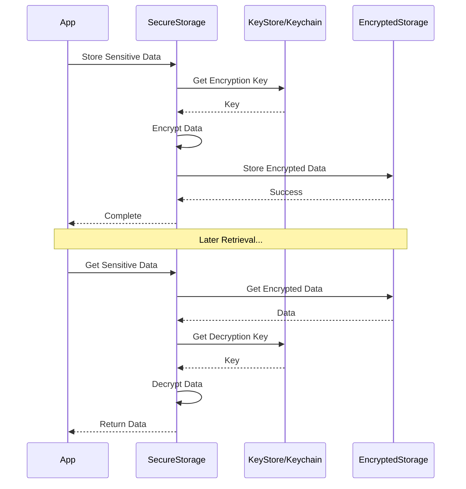

# Security Flow Diagrams

## Authentication Flows

### 1. Password Reset Flow

### 2. Biometric Authentication Flow

### 3. Account Deletion Flow

## Error Handling Flows

### 1. Rate Limiting Flow

### 2. Session Recovery Flow

## Data Protection Flows

### 1. Secure Storage Flow
